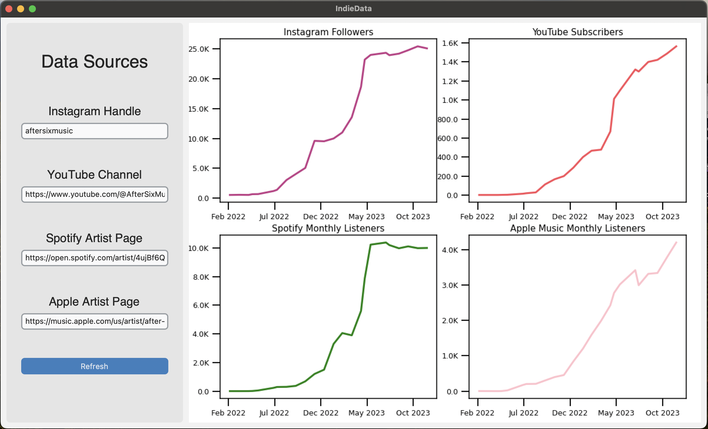
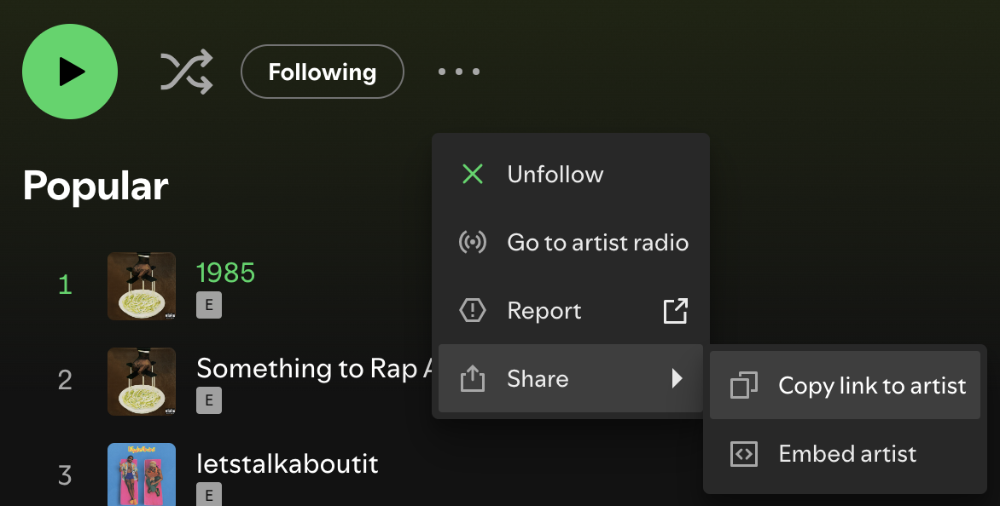

# IndieData
A dashboard to track a musician's digital growth for free
## Background
This project was a 24-hour personal challenge to get my feet wet with webscraping sources for music data. I was inspired by music industry data tools like Chartmetric and Luminate. I wanted to see if I could quickly make a simple data dashboard for independent artists to track their progress with initial support for 4 major platforms: Instagram (followers), YouTube (subscribers), Spotify (monthly listeners), and Apple Music (monthly listeners). This project will likely not be updated any further.

## Note on API Usage
The purpose of this project was to **AVOID** any paid APIs that sell the historical data to make these graphs. Instead, the intended user is a small indie artist who is just starting out and wants to track their growth for free. They can enter their socials and come back each day or week to take a snapshot of their progress and look back at their growth. *For this reason, no external APIs are used and no historical data is available.*

## Steps for Usage
1. Download the folder entitled "IndieData"
3. Open the file entitled "DataPoints.csv" and delete any existing data **EXCEPT for the first line**. Save it.
2. Run the file entitled "IndieData.py"
3. In the GUI that pops up, paste the following links into the fields of the form for the artist you wish to track.
    1. Instagram Handle (just the username)
    2. Full link to YouTube Channel
    3. Full link to Spotify Artist Page 
    
    4. Full link to Apple Music Artist Page (Apple Music support still coming)
4. Click "Refresh" button. This will save your entries for the next time you open the program while also fetching the current data from the links you provided. You may need to re-run the script if the graphs do not update.
5. Come back often and click "Refresh" whenever you open the app. As you refresh frequently, you will track more and more datapoints and build a better understanding of how you're growing as an artist.

### Required Dependencies

All can be installed using `pip install`

- pandas
- NumPy
- matplotlib
- datetime (built in to python)
- requests
- beautifulsoup4
- instaloader 
- re (for RegEx, built in to python)

**I've also included the .yml file for my conda environment if you'd prefer to do it that way.**\
It is called "environment.yml"